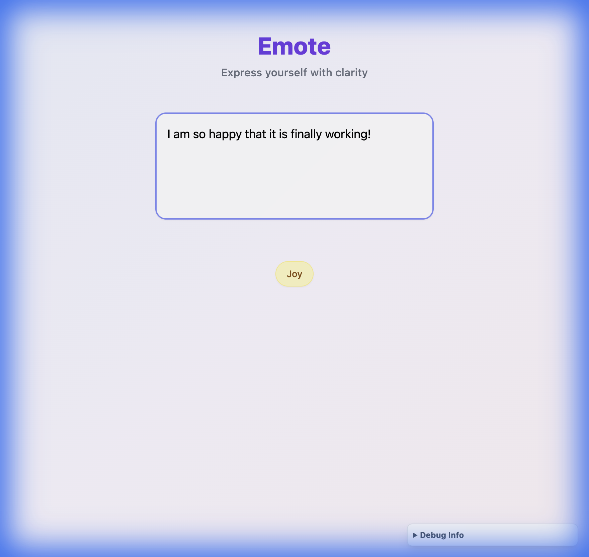
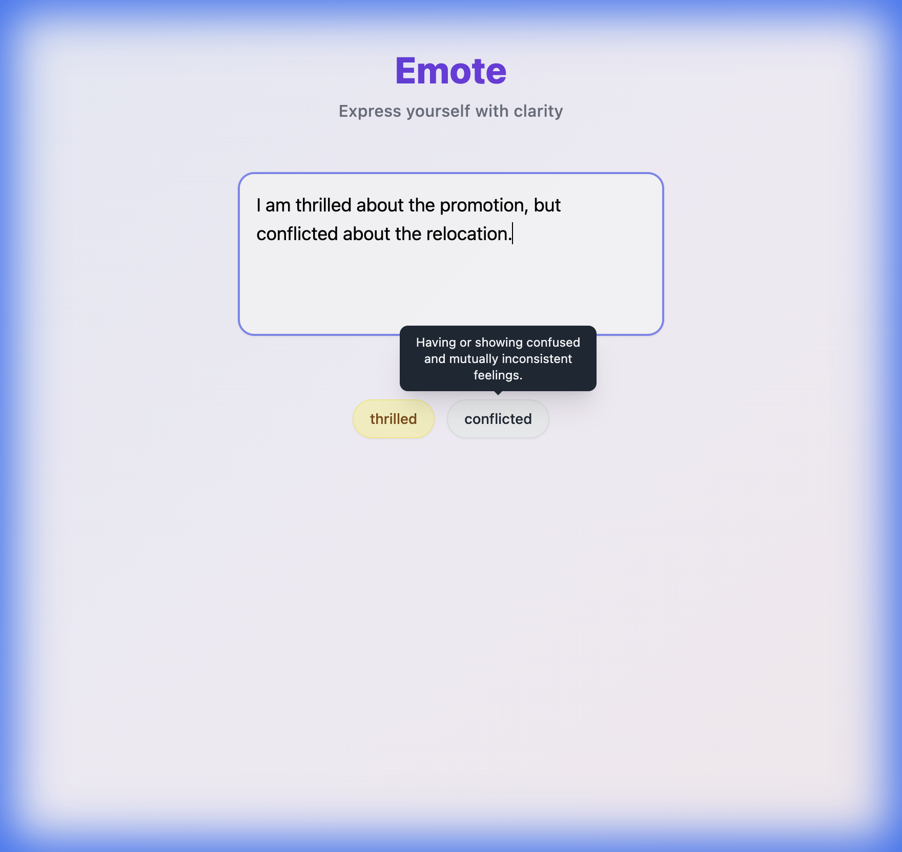
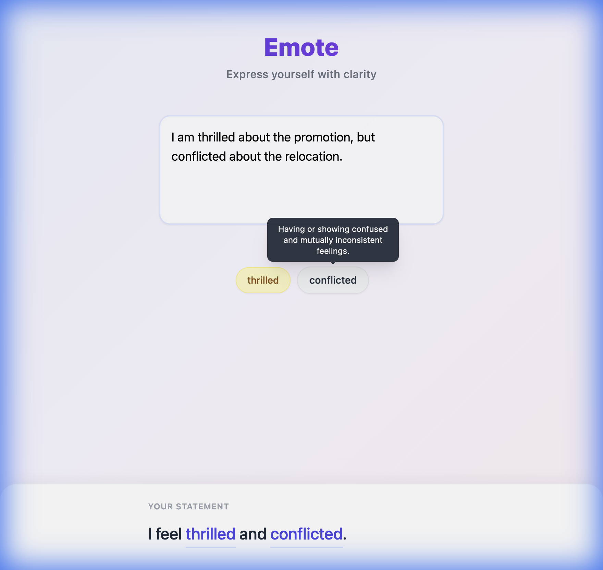
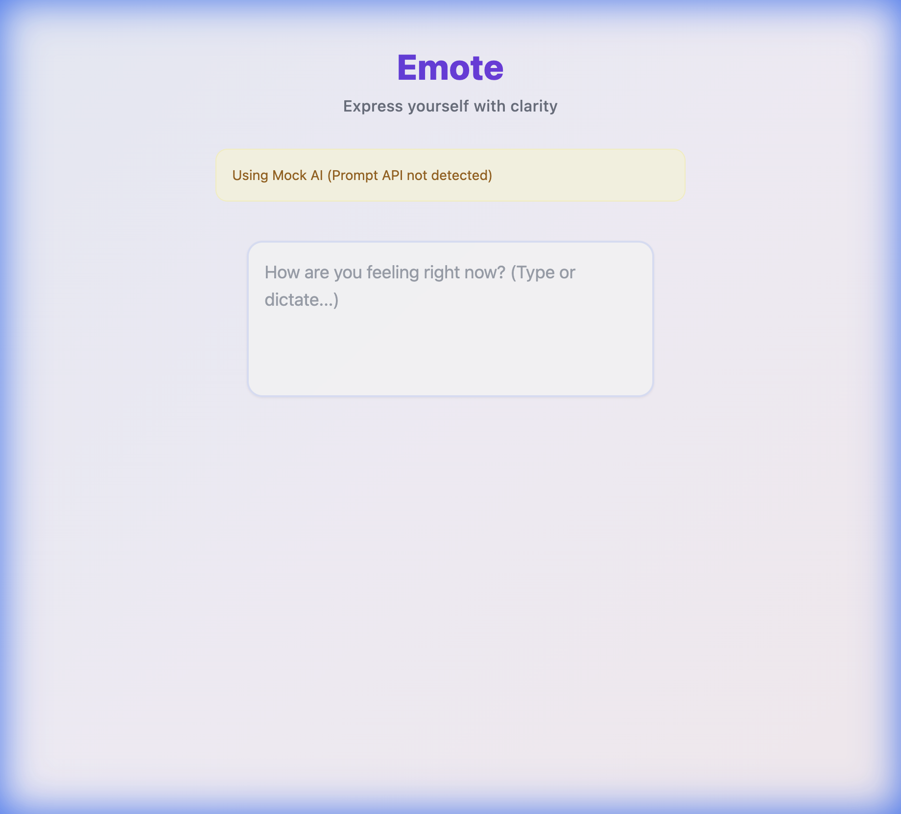

# Emote: Local AI NVC Assistant

Emote is a local-first web application that helps users articulate their feelings using **Non-Violent Communication (NVC)** principles. It uses Google Chrome's built-in **Gemini Nano** (via the Prompt API) to analyze text directly on your device, ensuring offline-capable interactions.



## ✨ Key Features
- **Local AI Processing**: Uses Chrome's experimental Prompt API to run Gemini Nano directly in the browser. No cloud calls, works completely offline.
- **NVC Vocabulary**: Trained to detect sophisticated emotions based on Non-Violent Communication literature (e.g., "Exhilarated" instead of just "Happy").
- **Educational Tooltips**: Hover over any detected emotion to see its precise definition.



- **"I Feel..." Builder**: Click emotions to construct a clear, structured sentence.



## 🚀 Prerequisites
**CRITICAL**: This app requires a specific Chrome environment to function.

1.  **Browser**: Google Chrome **128+** (Canary or Dev channel recommended).
2.  **Enable Flags**:
    *   `chrome://flags/#prompt-api-for-gemini-nano` -> **Enabled**
    *   `chrome://flags/#optimization-guide-on-device-model` -> **Enabled**

3.  **Model Download**:
    *   Go to `chrome://components`
    *   Find **Optimization Guide On Device Model**
    *   Click **Check for update**. Ensure a version is listed (e.g., `2024.5.21.1`).

## 🛠️ Installation & Running

### 1. Install Dependencies
```bash
npm install
```

### 2. Run Development Server
Start the local dev server with hot reload:
```bash
npm run dev
```
Open **http://localhost:5173** in your configured Chrome browser.

### 3. Build for Production
To create a production-ready build:
```bash
npm run build
```
This compiles the TypeScript and assets into the `dist/` folder.

You can preview the production build locally:
```bash
npm run preview
```

## ⚠️ Troubleshooting
If you see a yellow **"Using Mock AI"** banner, it means the Chrome Prompt API was not detected.



**Common Fixes:**
- **Restart Chrome** completely after enabling flags.
- Check `chrome://components` to ensure the model is fully downloaded.
- Ensure you are using `window.LanguageModel` (Chrome 144+) or `window.ai` (Legacy). This app supports both but prioritizes the newer standard.

## 📦 Tech Stack
- **Framework**: React + TypeScript (Vite)
- **Styling**: Tailwind CSS
- **AI**: Chrome Prompt API (Gemini Nano)
- **Data**: Custom NVC Emotion Dictionary
